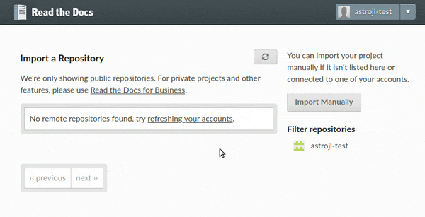

Read the Docs 文档托管
####################################

`Read the Docs <https://readthedocs.org/>`_ 是一个在线文档托管服务，它可以从 GitHub 仓库中导入文档自动构建 Sphinx 项目，并且在每次提交仓库修改后自动更新内容，非常方便。

创建 GitHub 项目
************************************

登录 GitHub 账号，打开 `Read the Docs 模板 <https://github.com/readthedocs/tutorial-template/>`_ 链接，点击绿色的 [Use this template] 按钮，使用模板创建新的 GitHub 仓库。

.. figure:: img/read_the_docs_01.png

    ▲ GitHub 仓库模板

.. attention::

    在使用模板创建新 GitHub 仓库时，必须使用公开（Public）仓库，而不是私有（Private）仓库。

模板仓库可以忽略（或删除） pyproject.toml 和 lumache.py 两个文件。主要使用以下文件：

- README.rst 仓库的基本描述
- docs/ 是存放 Sphinx 文档源的目录，其中包含 docs/source/ 目录。

Read the Docs
************************************

使用 GitHub 账号登录到 `Read the Docs <https://readthedocs.org/>`_ 。开始创建第一个文档托管项目。

点击 [Import a Project] 按钮进入导入仓库页面，点击仓库名后边的 [+] 按钮导入项目。如果未找到需要导入的仓库，请点击右上角的刷新按钮。

    ▲ Read the Docs 导入项目

项目导入完成后，将自动构建文档，点击已经构建的项目查看项目概况，点击 [阅读文档（View Docs）] 按钮查看生成文档的网页链接。

更多详情，请参见：https://docs.readthedocs.io/en/stable/tutorial/index.html。
