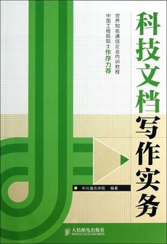

参考文献
####################################

网页
************************************

- `Sphinx 文档 <https://www.sphinx-doc.org/en/master/index.html>`_
- `Read the Docs 文档 <https://docs.readthedocs.io/en/stable/index.html>`_
- `reStructuredText 标记规范 <https://docutils.sourceforge.io/rst.html>`_
- `中文技术文档的写作规范，作者阮一峰 <http://www.ruanyifeng.com/blog/2016/10/document_style_guide.html>`_
- `中文文案排版指北 <https://github.com/sparanoid/chinese-copywriting-guidelines>`_
- `为什么文件名要小写 <http://www.ruanyifeng.com/blog/2017/02/filename-should-be-lowercase.html>`_

书籍
************************************

《科技文档写作实务》
====================================

:作者: 中兴通讯学院
:出版社: 人民邮电出版
:出版日期: 2013-8-1
:ISBN: 9787115320742
